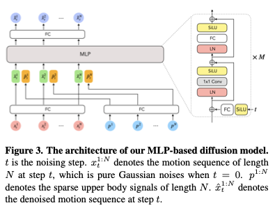
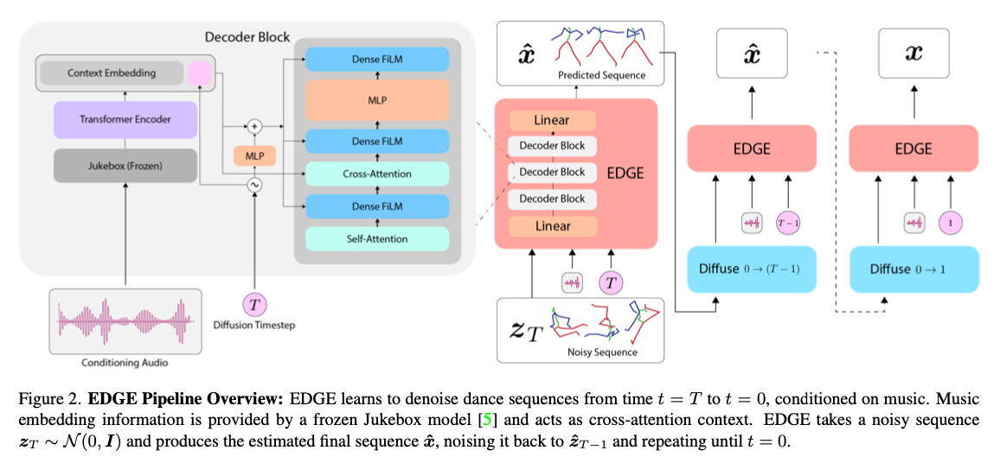
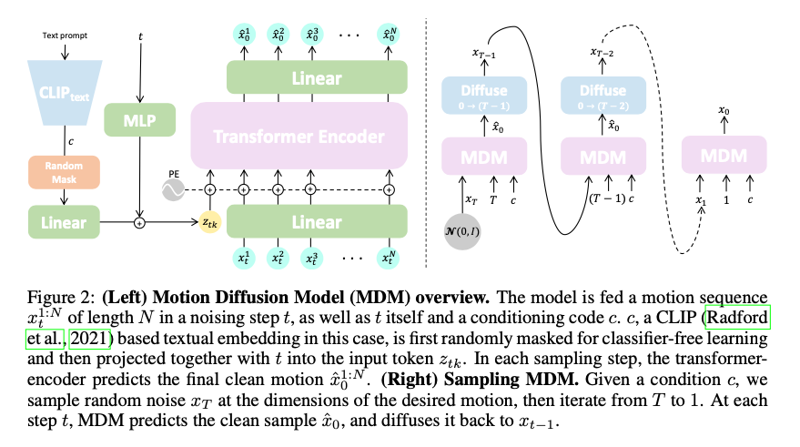
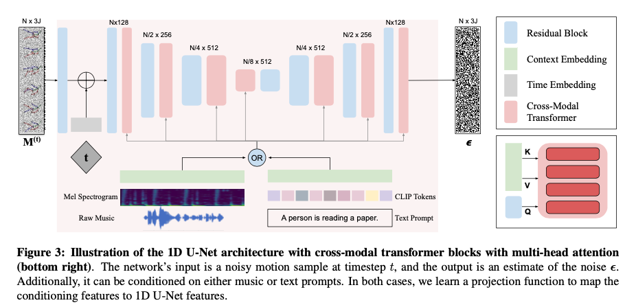
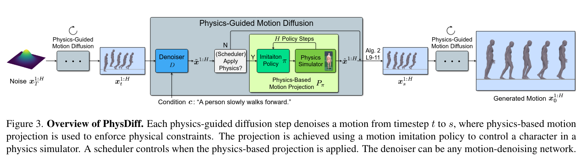

# Diffusion

**Avatars grow legs (sparse to complete diffusion)**
- *Sparse input -> full body motion*
- denoising sequence of SMPL params conditioned by sparse tracking inputs (orientation/translation of headset and two hand controllers)
- output: SMPL root orientation/translation, pose parameters
- Architecture
    - 12 layer MLP
    - Feature sizes: N x 512
    - Diffusion
        - input: noisy motion concat to partial tracking points (hands, head)
        - output: directly predict denoised motion sequence
    - Timestep embedding: encode, then add to each MLP block features
        - As mlp, forces it to take notice of timestep
    - Skeleten: S = 22 x 6
    - Num Frames: N = 196
    - 

**EDGE**
- *Music -> full body motion*
- Denoising sequence poses conditioned on music features
- Useful aspects
    - Describes inpainting which would be useful to us (just modify legs for example)
        - We might be interested in just modifying occluded joints
    - Describes temporal constraints for longer sequences
- Architecture
    - Transformer based
    - Pose representation
        - 24 joint SMPL, 6d
        - root translation
        - binary foot contacts
    - Direct denoising
        - Tries to denoise the sequence in one step
    - Timstep embedding:
        - Features treated as cross-attention context in transformer
    - Num frames: N = 150 (5s at 30fps)
    - FiLM: feature wise linear modulation?
    - 

**MDM**
- *Text -> full body motion*
- Similar to EDGE
- Conditioned on text
- Also attempts unconditioned synthesis
    - Say this is a difficult problem
- Architecture
    - Latent dimension: 512
    - Num layers: 8 
    - State x
        - joint positions or rotations
        - foot contacts
    - Direct denoised prediction ('simple objective')
    - 

**MoFusion**
- *Music/Text -> full body motion*
- Closer to original diffusion models
    - Predicts Noise 
    - Uses U-net
- Architecture
    - Does have transformer blocks
    - 

**Motion Diffuse**
- **
- TODO: make notes

**PhysDiff**
- *Text -> full body motion*
- denoising sequence poses conditioned on promt, e.g 'walking round a bend'
- Goal: create sequence of motion from promt
- Physics-based motion projection step in the diffusion
    - Achieved using a motion imitation policy to control a character in a
    physics simulator
    - Architecture
    - 

**Common elements**
- Classifier free guidance
    - Randomly mask conditioning, so it also learns base distribution
    - Allows mixing of denoising sample with and without conditioning (c.f MDM)
    - Probably not so useful for us to begin with, as we won't have conditioning
- Direct signal prediction: 'simple objective'
    - Directly predict clean sample, then diffuse it back to then next step
    - Predict signal, not noise
    - 'Simple objective' (found in Ho. et al, Denoising diffusion probabilistic models, 2020)
- Losses
    - Foot contacts
    - Velocities
    - Positions
- Timestep embedding
    - Run it through a linear layer
    - Concat or add to features of model
- Forward kinematics
    - State: joints rotations
    - Use FK to get 3d
- Latent features
    - Most seem to have constant feature size, rather than a U-net like the original diffusion models

---
**Idea 1**

- Motivation
    - Stage2 humor performed well
    - Issues & potential solutions
        - Occluded situations
            - Noise and denoise occlusions (joints with low probability)
        - Bad 2d pose estimations
            - Some scheme for identifying them, then remove them and inpaint with diffusion
                - Heuristic: 
                    - randomly appearing joints for a few frames
                - Learned: motion modelling
                    - Use some sort of humor model to see where likelihood is lowest
                    - Use some sequence level VAE to see where likelihood is lowest
                - Learned: semantic mask
                    - Apply a method that identifies people
            - This would come second, after proving that the diffusion works for simply occluded situations
- IDEA
    - Generate sequence of $x$'s similar to stage 2 of humor, they performed well except in occluded situations, or if 2d predictions were bad
    - Noise all the joints with 2d predictions less than some threshold confidence
    - Denoise with diffusion
    - **Start**
        - no conditioning
    - **Future ideas**
        - Try condition in some way to tell the model what part of the body needs denoising
        - Try more structural noise rather than just random noise
            - Flips
            - Jitter
            - 
- ISSUES
    - If the 2d predictions are bad but confident and we can't identify them, this method won't work well as we rely too heavily on the 2d predictions
        - Whereas a motion aware could recover from such a situation through the likelihood of the motion
- DIFFUSION MODEL
    - Unconditioned diffusion
        - Transformer or MLP, try both as in AGRoL and EDGE papers
    - Simply denoises sequences
    - Then we apply inpainting to denoise specific joints
- IMPLEMENTATION
    - Code for MDM is available, they perform unconditional inpainting
        - We could try and adapt this
        - I'd rather impelement everything from scratch